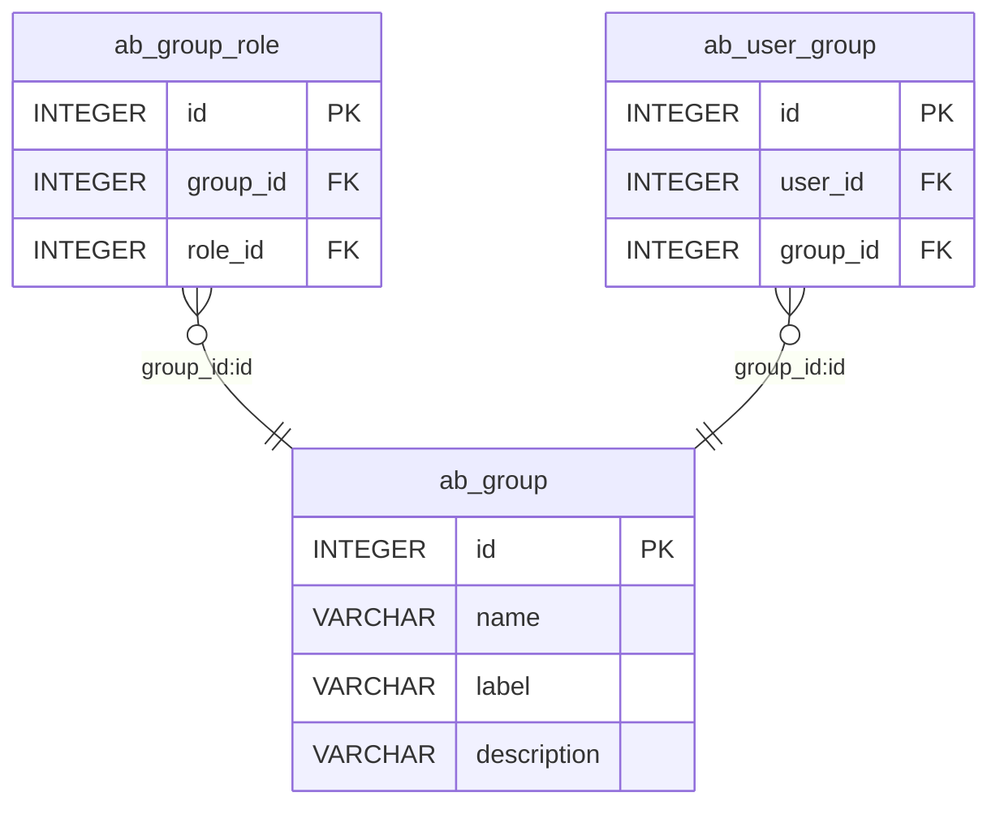
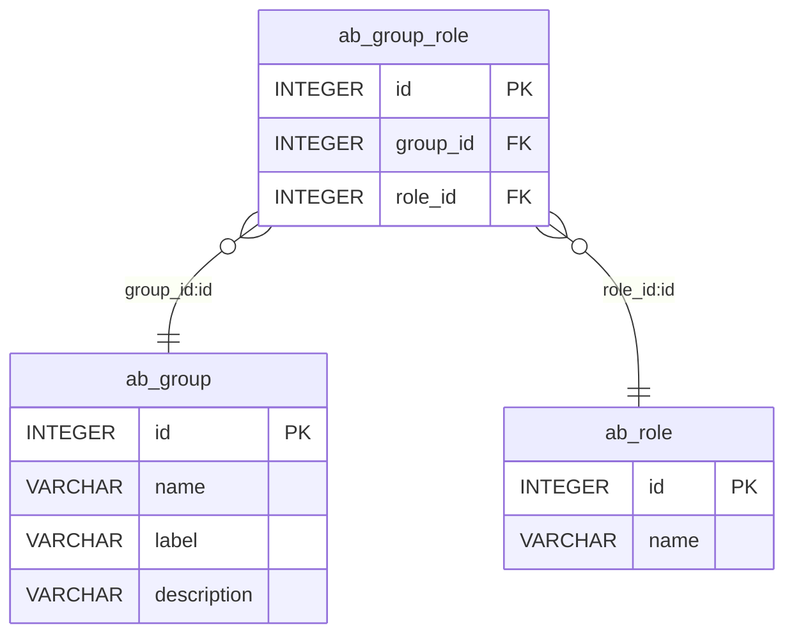
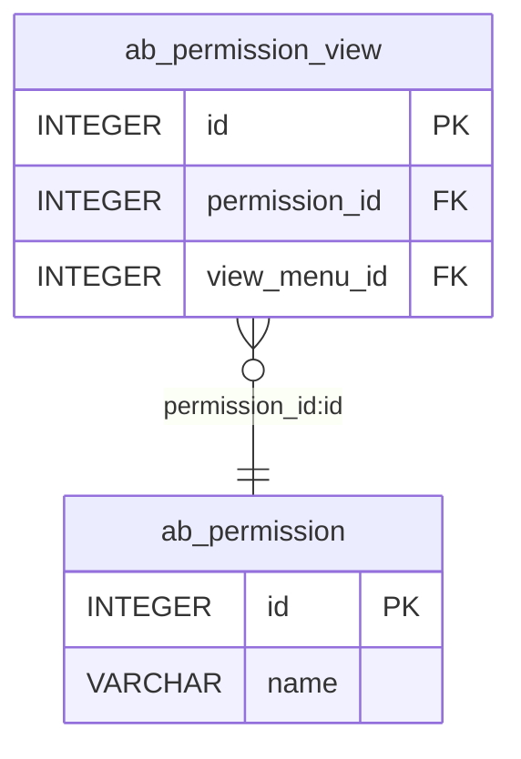
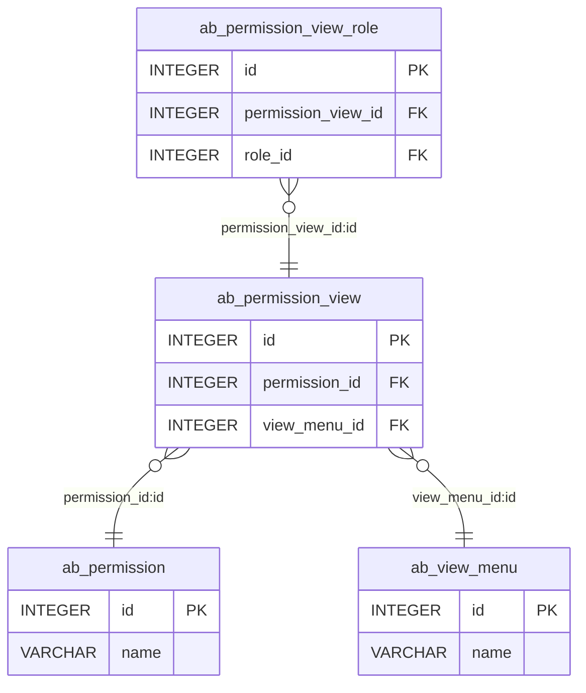
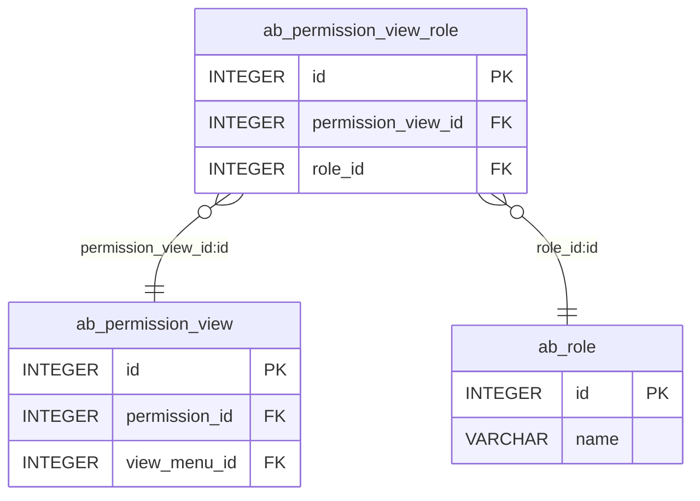
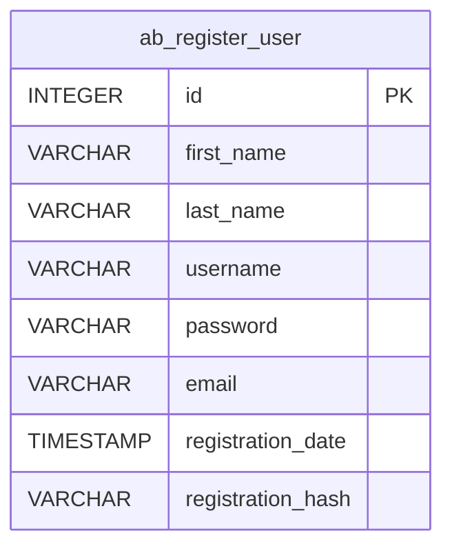
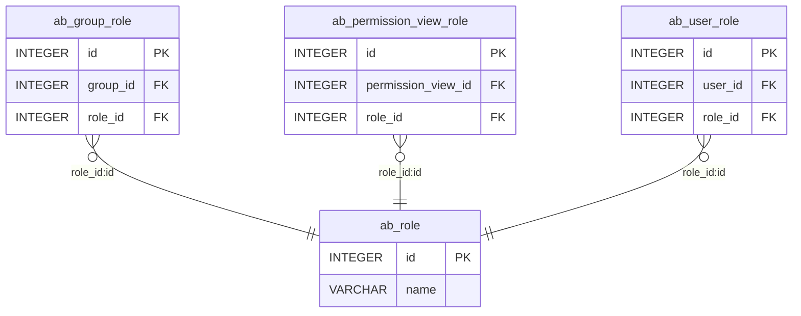
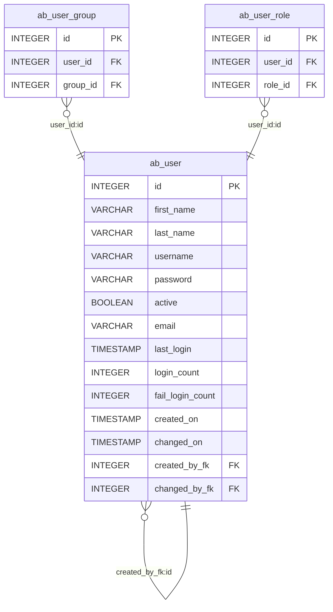
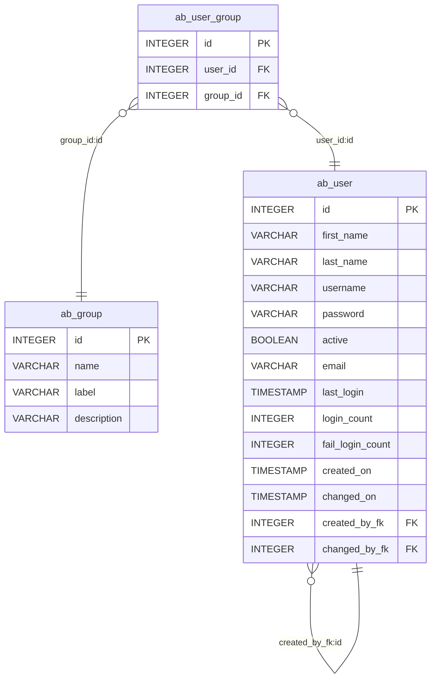
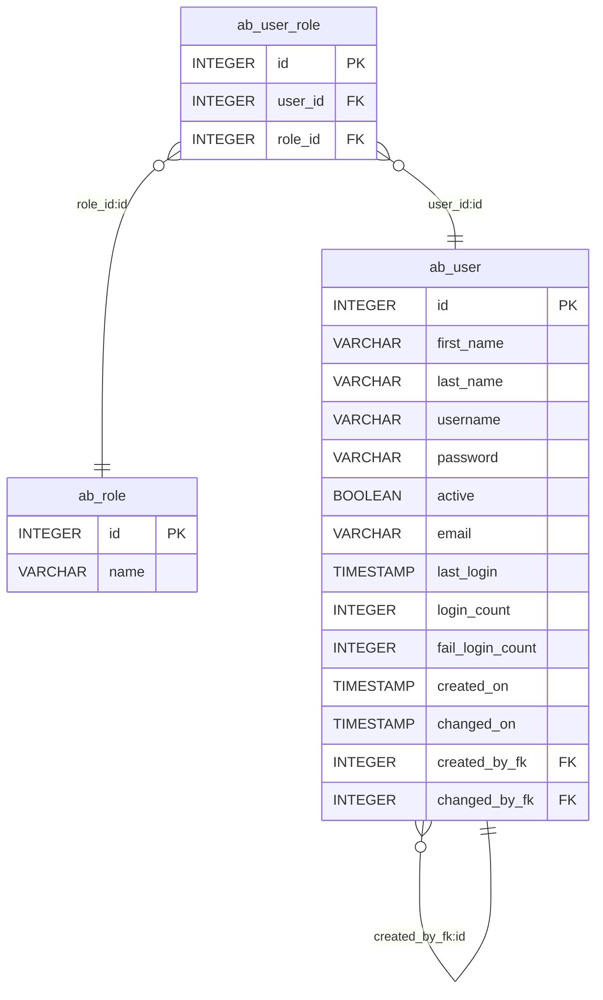

# Airflow ab_* PostgreSQL Database Diagrams

## ab_group

## ab_group_role

## ab_permission

## ab_permission_view

## ab_permission_view_role

## ab_register_user

## ab_role

## ab_user

## ab_user_group

## ab_user_role

## ab_view_menu

