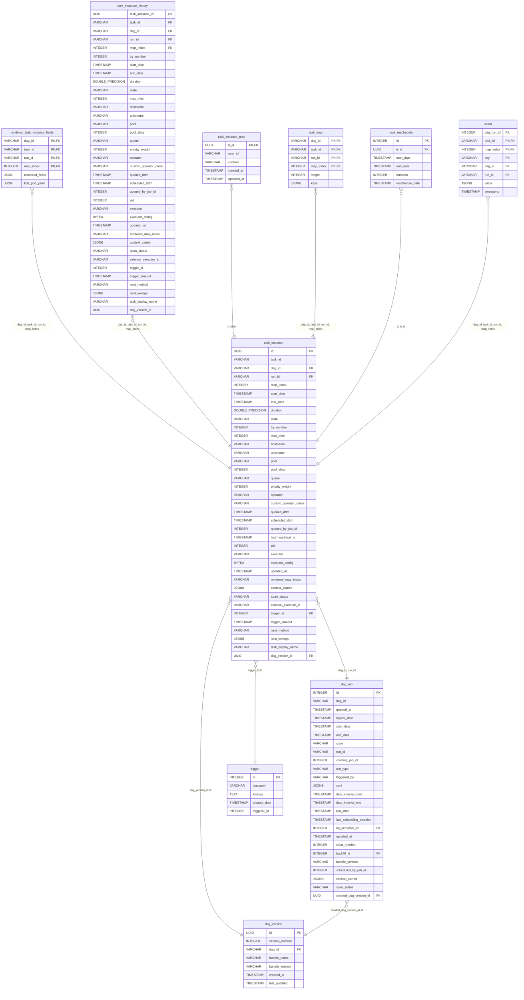
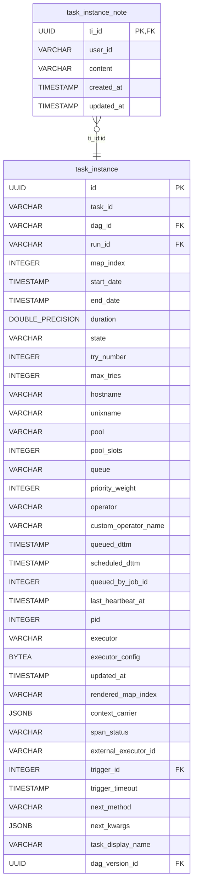
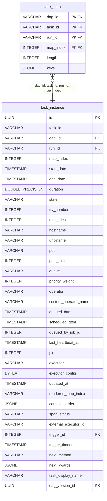
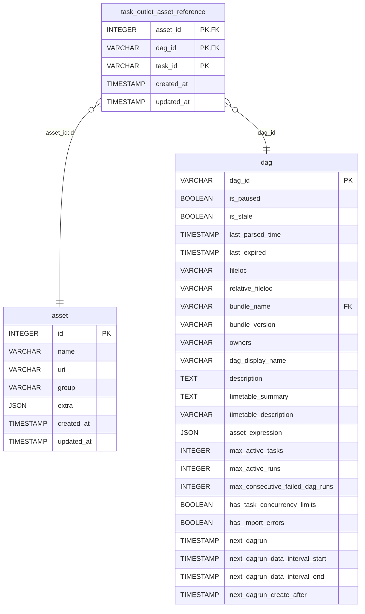
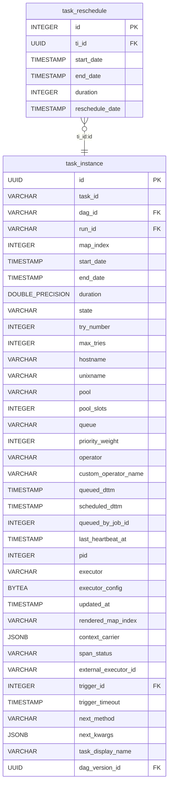

# Airflow task_* PostgreSQL Database Diagrams

## task_instance

```mermaid
erDiagram
    task_instance {
        UUID id PK
        VARCHAR task_id
        VARCHAR dag_id FK
        VARCHAR run_id FK
        INTEGER map_index
        TIMESTAMP start_date
        TIMESTAMP end_date
        DOUBLE_PRECISION duration
        VARCHAR state
        INTEGER try_number
        INTEGER max_tries
        VARCHAR hostname
        VARCHAR unixname
        VARCHAR pool
        INTEGER pool_slots
        VARCHAR queue
        INTEGER priority_weight
        VARCHAR operator
        VARCHAR custom_operator_name
        TIMESTAMP queued_dttm
        TIMESTAMP scheduled_dttm
        INTEGER queued_by_job_id
        TIMESTAMP last_heartbeat_at
        INTEGER pid
        VARCHAR executor
        BYTEA executor_config
        TIMESTAMP updated_at
        VARCHAR rendered_map_index
        JSONB context_carrier
        VARCHAR span_status
        VARCHAR external_executor_id
        INTEGER trigger_id FK
        TIMESTAMP trigger_timeout
        VARCHAR next_method
        JSONB next_kwargs
        VARCHAR task_display_name
        UUID dag_version_id FK
    }
    task_instance }o--|| dag_run : "dag_id, run_id"
    task_instance }o--|| dag_version : "dag_version_id:id"
    task_instance }o--|| trigger : "trigger_id:id"
    dag_run {
        INTEGER id PK
        VARCHAR dag_id
        TIMESTAMP queued_at
        TIMESTAMP logical_date
        TIMESTAMP start_date
        TIMESTAMP end_date
        VARCHAR state
        VARCHAR run_id
        INTEGER creating_job_id
        VARCHAR run_type
        VARCHAR triggered_by
        JSONB conf
        TIMESTAMP data_interval_start
        TIMESTAMP data_interval_end
        TIMESTAMP run_after
        TIMESTAMP last_scheduling_decision
        INTEGER log_template_id FK
        TIMESTAMP updated_at
        INTEGER clear_number
        INTEGER backfill_id FK
        VARCHAR bundle_version
        INTEGER scheduled_by_job_id
        JSONB context_carrier
        VARCHAR span_status
        UUID created_dag_version_id FK
    }
    dag_run }o--|| dag_version : "created_dag_version_id:id"
    dag_version {
        UUID id PK
        INTEGER version_number
        VARCHAR dag_id FK
        VARCHAR bundle_name
        VARCHAR bundle_version
        TIMESTAMP created_at
        TIMESTAMP last_updated
    }
    rendered_task_instance_fields {
        VARCHAR dag_id PK, FK
        VARCHAR task_id PK, FK
        VARCHAR run_id PK, FK
        INTEGER map_index PK, FK
        JSON rendered_fields
        JSON k8s_pod_yaml
    }
    rendered_task_instance_fields }o--|| task_instance : "dag_id, task_id, run_id, map_index"
    task_instance_history {
        UUID task_instance_id PK
        VARCHAR task_id FK
        VARCHAR dag_id FK
        VARCHAR run_id FK
        INTEGER map_index FK
        INTEGER try_number
        TIMESTAMP start_date
        TIMESTAMP end_date
        DOUBLE_PRECISION duration
        VARCHAR state
        INTEGER max_tries
        VARCHAR hostname
        VARCHAR unixname
        VARCHAR pool
        INTEGER pool_slots
        VARCHAR queue
        INTEGER priority_weight
        VARCHAR operator
        VARCHAR custom_operator_name
        TIMESTAMP queued_dttm
        TIMESTAMP scheduled_dttm
        INTEGER queued_by_job_id
        INTEGER pid
        VARCHAR executor
        BYTEA executor_config
        TIMESTAMP updated_at
        VARCHAR rendered_map_index
        JSONB context_carrier
        VARCHAR span_status
        VARCHAR external_executor_id
        INTEGER trigger_id
        TIMESTAMP trigger_timeout
        VARCHAR next_method
        JSONB next_kwargs
        VARCHAR task_display_name
        UUID dag_version_id
    }
    task_instance_history }o--|| task_instance : "dag_id, task_id, run_id, map_index"
    task_instance_note {
        UUID ti_id PK, FK
        VARCHAR user_id
        VARCHAR content
        TIMESTAMP created_at
        TIMESTAMP updated_at
    }
    task_instance_note }o--|| task_instance : "ti_id:id"
    task_map {
        VARCHAR dag_id PK, FK
        VARCHAR task_id PK, FK
        VARCHAR run_id PK, FK
        INTEGER map_index PK, FK
        INTEGER length
        JSONB keys
    }
    task_map }o--|| task_instance : "dag_id, task_id, run_id, map_index"
    task_reschedule {
        INTEGER id PK
        UUID ti_id FK
        TIMESTAMP start_date
        TIMESTAMP end_date
        INTEGER duration
        TIMESTAMP reschedule_date
    }
    task_reschedule }o--|| task_instance : "ti_id:id"
    trigger {
        INTEGER id PK
        VARCHAR classpath
        TEXT kwargs
        TIMESTAMP created_date
        INTEGER triggerer_id
    }
    xcom {
        INTEGER dag_run_id PK
        VARCHAR task_id PK, FK
        INTEGER map_index PK, FK
        VARCHAR key PK
        VARCHAR dag_id FK
        VARCHAR run_id FK
        JSONB value
        TIMESTAMP timestamp
    }
    xcom }o--|| task_instance : "dag_id, task_id, run_id, map_index"
```

## task_instance_history

```mermaid
erDiagram
    task_instance_history {
        UUID task_instance_id PK
        VARCHAR task_id FK
        VARCHAR dag_id FK
        VARCHAR run_id FK
        INTEGER map_index FK
        INTEGER try_number
        TIMESTAMP start_date
        TIMESTAMP end_date
        DOUBLE_PRECISION duration
        VARCHAR state
        INTEGER max_tries
        VARCHAR hostname
        VARCHAR unixname
        VARCHAR pool
        INTEGER pool_slots
        VARCHAR queue
        INTEGER priority_weight
        VARCHAR operator
        VARCHAR custom_operator_name
        TIMESTAMP queued_dttm
        TIMESTAMP scheduled_dttm
        INTEGER queued_by_job_id
        INTEGER pid
        VARCHAR executor
        BYTEA executor_config
        TIMESTAMP updated_at
        VARCHAR rendered_map_index
        JSONB context_carrier
        VARCHAR span_status
        VARCHAR external_executor_id
        INTEGER trigger_id
        TIMESTAMP trigger_timeout
        VARCHAR next_method
        JSONB next_kwargs
        VARCHAR task_display_name
        UUID dag_version_id
    }
    task_instance_history }o--|| task_instance : "dag_id, task_id, run_id, map_index"
    task_instance {
        UUID id PK
        VARCHAR task_id
        VARCHAR dag_id FK
        VARCHAR run_id FK
        INTEGER map_index
        TIMESTAMP start_date
        TIMESTAMP end_date
        DOUBLE_PRECISION duration
        VARCHAR state
        INTEGER try_number
        INTEGER max_tries
        VARCHAR hostname
        VARCHAR unixname
        VARCHAR pool
        INTEGER pool_slots
        VARCHAR queue
        INTEGER priority_weight
        VARCHAR operator
        VARCHAR custom_operator_name
        TIMESTAMP queued_dttm
        TIMESTAMP scheduled_dttm
        INTEGER queued_by_job_id
        TIMESTAMP last_heartbeat_at
        INTEGER pid
        VARCHAR executor
        BYTEA executor_config
        TIMESTAMP updated_at
        VARCHAR rendered_map_index
        JSONB context_carrier
        VARCHAR span_status
        VARCHAR external_executor_id
        INTEGER trigger_id FK
        TIMESTAMP trigger_timeout
        VARCHAR next_method
        JSONB next_kwargs
        VARCHAR task_display_name
        UUID dag_version_id FK
    }
```

## task_instance_note

```mermaid
erDiagram
    task_instance_note {
        UUID ti_id PK, FK
        VARCHAR user_id
        VARCHAR content
        TIMESTAMP created_at
        TIMESTAMP updated_at
    }
    task_instance_note }o--|| task_instance : "ti_id:id"
    task_instance {
        UUID id PK
        VARCHAR task_id
        VARCHAR dag_id FK
        VARCHAR run_id FK
        INTEGER map_index
        TIMESTAMP start_date
        TIMESTAMP end_date
        DOUBLE_PRECISION duration
        VARCHAR state
        INTEGER try_number
        INTEGER max_tries
        VARCHAR hostname
        VARCHAR unixname
        VARCHAR pool
        INTEGER pool_slots
        VARCHAR queue
        INTEGER priority_weight
        VARCHAR operator
        VARCHAR custom_operator_name
        TIMESTAMP queued_dttm
        TIMESTAMP scheduled_dttm
        INTEGER queued_by_job_id
        TIMESTAMP last_heartbeat_at
        INTEGER pid
        VARCHAR executor
        BYTEA executor_config
        TIMESTAMP updated_at
        VARCHAR rendered_map_index
        JSONB context_carrier
        VARCHAR span_status
        VARCHAR external_executor_id
        INTEGER trigger_id FK
        TIMESTAMP trigger_timeout
        VARCHAR next_method
        JSONB next_kwargs
        VARCHAR task_display_name
        UUID dag_version_id FK
    }
```

## task_map

```mermaid
erDiagram
    task_map {
        VARCHAR dag_id PK, FK
        VARCHAR task_id PK, FK
        VARCHAR run_id PK, FK
        INTEGER map_index PK, FK
        INTEGER length
        JSONB keys
    }
    task_map }o--|| task_instance : "dag_id, task_id, run_id, map_index"
    task_instance {
        UUID id PK
        VARCHAR task_id
        VARCHAR dag_id FK
        VARCHAR run_id FK
        INTEGER map_index
        TIMESTAMP start_date
        TIMESTAMP end_date
        DOUBLE_PRECISION duration
        VARCHAR state
        INTEGER try_number
        INTEGER max_tries
        VARCHAR hostname
        VARCHAR unixname
        VARCHAR pool
        INTEGER pool_slots
        VARCHAR queue
        INTEGER priority_weight
        VARCHAR operator
        VARCHAR custom_operator_name
        TIMESTAMP queued_dttm
        TIMESTAMP scheduled_dttm
        INTEGER queued_by_job_id
        TIMESTAMP last_heartbeat_at
        INTEGER pid
        VARCHAR executor
        BYTEA executor_config
        TIMESTAMP updated_at
        VARCHAR rendered_map_index
        JSONB context_carrier
        VARCHAR span_status
        VARCHAR external_executor_id
        INTEGER trigger_id FK
        TIMESTAMP trigger_timeout
        VARCHAR next_method
        JSONB next_kwargs
        VARCHAR task_display_name
        UUID dag_version_id FK
    }
```

## task_outlet_asset_reference

```mermaid
erDiagram
    task_outlet_asset_reference {
        INTEGER asset_id PK, FK
        VARCHAR dag_id PK, FK
        VARCHAR task_id PK
        TIMESTAMP created_at
        TIMESTAMP updated_at
    }
    task_outlet_asset_reference }o--|| asset : "asset_id:id"
    task_outlet_asset_reference }o--|| dag : "dag_id"
    asset {
        INTEGER id PK
        VARCHAR name
        VARCHAR uri
        VARCHAR group
        JSON extra
        TIMESTAMP created_at
        TIMESTAMP updated_at
    }
    dag {
        VARCHAR dag_id PK
        BOOLEAN is_paused
        BOOLEAN is_stale
        TIMESTAMP last_parsed_time
        TIMESTAMP last_expired
        VARCHAR fileloc
        VARCHAR relative_fileloc
        VARCHAR bundle_name FK
        VARCHAR bundle_version
        VARCHAR owners
        VARCHAR dag_display_name
        TEXT description
        TEXT timetable_summary
        VARCHAR timetable_description
        JSON asset_expression
        INTEGER max_active_tasks
        INTEGER max_active_runs
        INTEGER max_consecutive_failed_dag_runs
        BOOLEAN has_task_concurrency_limits
        BOOLEAN has_import_errors
        TIMESTAMP next_dagrun
        TIMESTAMP next_dagrun_data_interval_start
        TIMESTAMP next_dagrun_data_interval_end
        TIMESTAMP next_dagrun_create_after
    }
```

## task_reschedule

```mermaid
erDiagram
    task_reschedule {
        INTEGER id PK
        UUID ti_id FK
        TIMESTAMP start_date
        TIMESTAMP end_date
        INTEGER duration
        TIMESTAMP reschedule_date
    }
    task_reschedule }o--|| task_instance : "ti_id:id"
    task_instance {
        UUID id PK
        VARCHAR task_id
        VARCHAR dag_id FK
        VARCHAR run_id FK
        INTEGER map_index
        TIMESTAMP start_date
        TIMESTAMP end_date
        DOUBLE_PRECISION duration
        VARCHAR state
        INTEGER try_number
        INTEGER max_tries
        VARCHAR hostname
        VARCHAR unixname
        VARCHAR pool
        INTEGER pool_slots
        VARCHAR queue
        INTEGER priority_weight
        VARCHAR operator
        VARCHAR custom_operator_name
        TIMESTAMP queued_dttm
        TIMESTAMP scheduled_dttm
        INTEGER queued_by_job_id
        TIMESTAMP last_heartbeat_at
        INTEGER pid
        VARCHAR executor
        BYTEA executor_config
        TIMESTAMP updated_at
        VARCHAR rendered_map_index
        JSONB context_carrier
        VARCHAR span_status
        VARCHAR external_executor_id
        INTEGER trigger_id FK
        TIMESTAMP trigger_timeout
        VARCHAR next_method
        JSONB next_kwargs
        VARCHAR task_display_name
        UUID dag_version_id FK
    }
```
