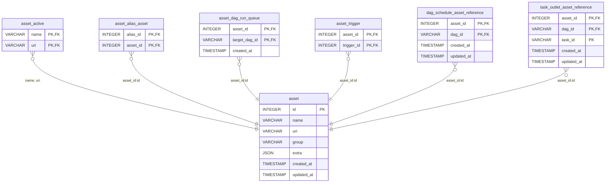
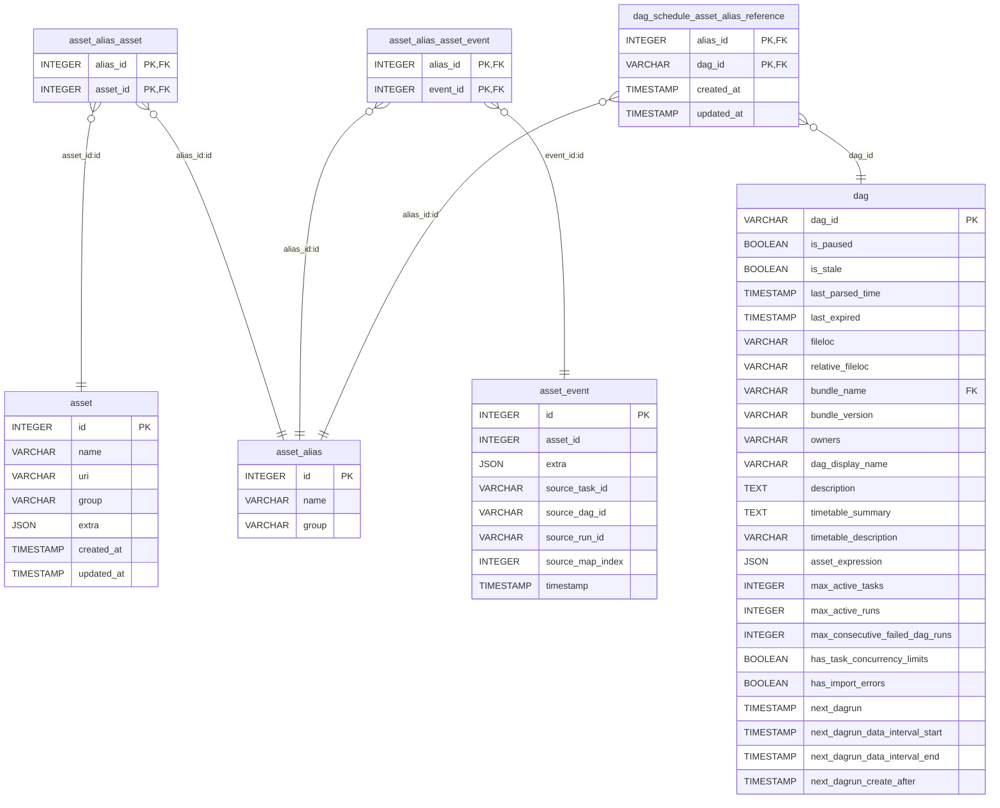
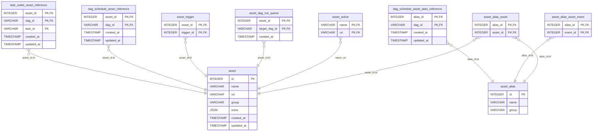
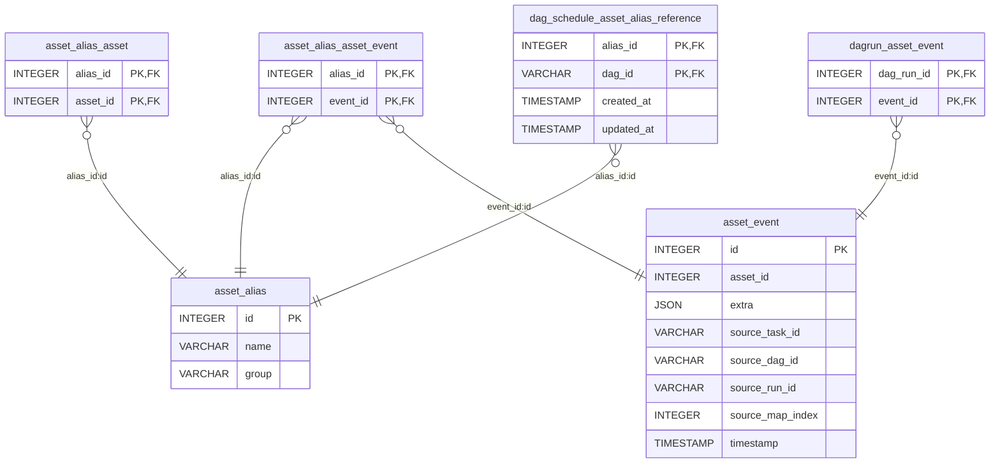
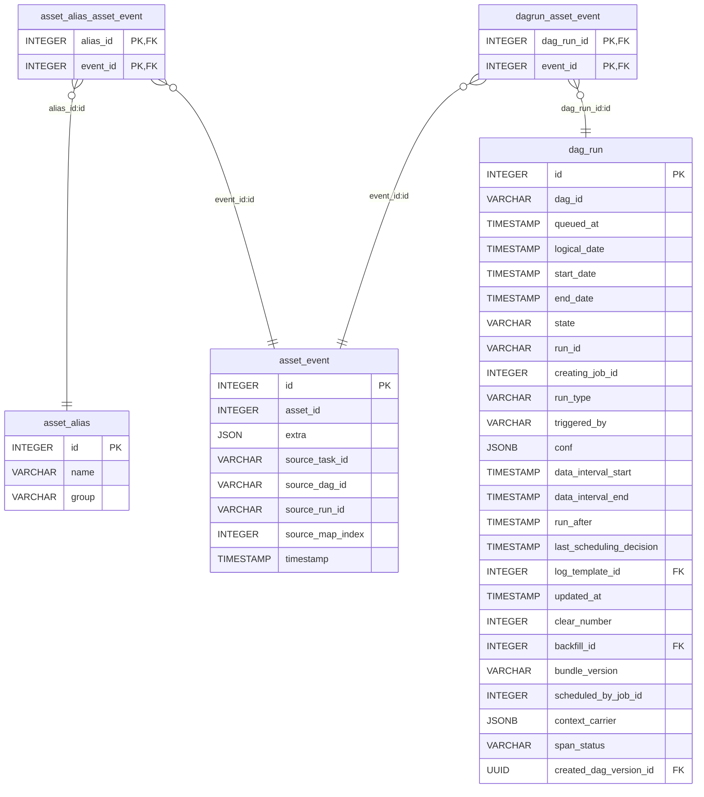
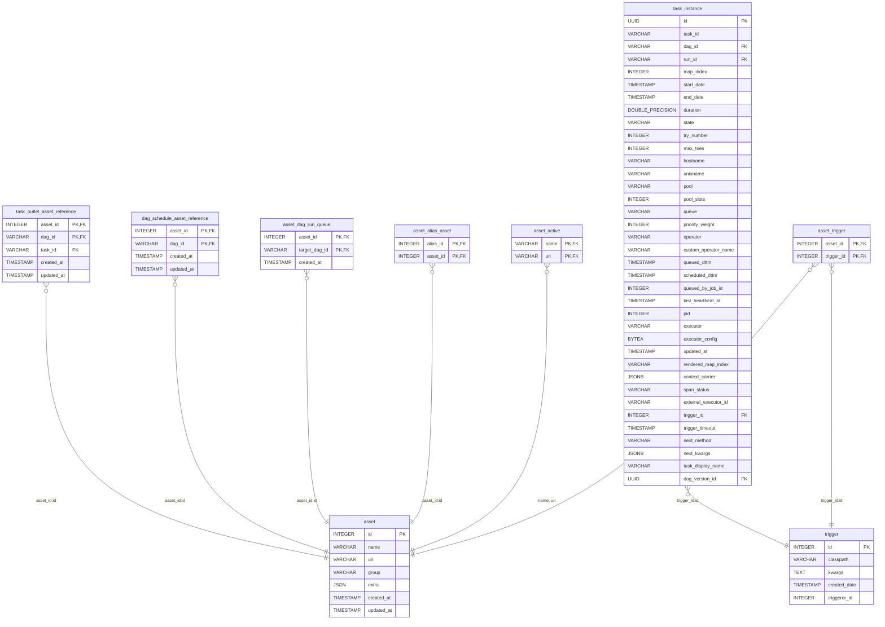

# Airflow asset_* PostgreSQL Database Diagrams

## asset_active

```mermaid
erDiagram
    asset_active {
        VARCHAR name PK, FK
        VARCHAR uri PK, FK
    }
    asset_active }o--|| asset : "name, uri"
    asset {
        INTEGER id PK
        VARCHAR name
        VARCHAR uri
        VARCHAR group
        JSON extra
        TIMESTAMP created_at
        TIMESTAMP updated_at
    }
    asset_alias_asset {
        INTEGER alias_id PK, FK
        INTEGER asset_id PK, FK
    }
    asset_alias_asset }o--|| asset : "asset_id:id"
    asset_dag_run_queue {
        INTEGER asset_id PK, FK
        VARCHAR target_dag_id PK, FK
        TIMESTAMP created_at
    }
    asset_dag_run_queue }o--|| asset : "asset_id:id"
    asset_trigger {
        INTEGER asset_id PK, FK
        INTEGER trigger_id PK, FK
    }
    asset_trigger }o--|| asset : "asset_id:id"
    dag_schedule_asset_reference {
        INTEGER asset_id PK, FK
        VARCHAR dag_id PK, FK
        TIMESTAMP created_at
        TIMESTAMP updated_at
    }
    dag_schedule_asset_reference }o--|| asset : "asset_id:id"
    task_outlet_asset_reference {
        INTEGER asset_id PK, FK
        VARCHAR dag_id PK, FK
        VARCHAR task_id PK
        TIMESTAMP created_at
        TIMESTAMP updated_at
    }
    task_outlet_asset_reference }o--|| asset : "asset_id:id"
```

## asset_alias

```mermaid
erDiagram
    asset_alias {
        INTEGER id PK
        VARCHAR name
        VARCHAR group
    }
    asset_alias_asset {
        INTEGER alias_id PK, FK
        INTEGER asset_id PK, FK
    }
    asset_alias_asset }o--|| asset : "asset_id:id"
    asset_alias_asset }o--|| asset_alias : "alias_id:id"
    asset {
        INTEGER id PK
        VARCHAR name
        VARCHAR uri
        VARCHAR group
        JSON extra
        TIMESTAMP created_at
        TIMESTAMP updated_at
    }
    asset_alias_asset_event {
        INTEGER alias_id PK, FK
        INTEGER event_id PK, FK
    }
    asset_alias_asset_event }o--|| asset_alias : "alias_id:id"
    asset_alias_asset_event }o--|| asset_event : "event_id:id"
    asset_event {
        INTEGER id PK
        INTEGER asset_id
        JSON extra
        VARCHAR source_task_id
        VARCHAR source_dag_id
        VARCHAR source_run_id
        INTEGER source_map_index
        TIMESTAMP timestamp
    }
    dag_schedule_asset_alias_reference {
        INTEGER alias_id PK, FK
        VARCHAR dag_id PK, FK
        TIMESTAMP created_at
        TIMESTAMP updated_at
    }
    dag_schedule_asset_alias_reference }o--|| asset_alias : "alias_id:id"
    dag_schedule_asset_alias_reference }o--|| dag : "dag_id"
    dag {
        VARCHAR dag_id PK
        BOOLEAN is_paused
        BOOLEAN is_stale
        TIMESTAMP last_parsed_time
        TIMESTAMP last_expired
        VARCHAR fileloc
        VARCHAR relative_fileloc
        VARCHAR bundle_name FK
        VARCHAR bundle_version
        VARCHAR owners
        VARCHAR dag_display_name
        TEXT description
        TEXT timetable_summary
        VARCHAR timetable_description
        JSON asset_expression
        INTEGER max_active_tasks
        INTEGER max_active_runs
        INTEGER max_consecutive_failed_dag_runs
        BOOLEAN has_task_concurrency_limits
        BOOLEAN has_import_errors
        TIMESTAMP next_dagrun
        TIMESTAMP next_dagrun_data_interval_start
        TIMESTAMP next_dagrun_data_interval_end
        TIMESTAMP next_dagrun_create_after
    }
```

## asset_alias_asset

```mermaid
erDiagram
    asset_alias_asset {
        INTEGER alias_id PK, FK
        INTEGER asset_id PK, FK
    }
    asset_alias_asset }o--|| asset : "asset_id:id"
    asset_alias_asset }o--|| asset_alias : "alias_id:id"
    asset {
        INTEGER id PK
        VARCHAR name
        VARCHAR uri
        VARCHAR group
        JSON extra
        TIMESTAMP created_at
        TIMESTAMP updated_at
    }
    asset_active {
        VARCHAR name PK, FK
        VARCHAR uri PK, FK
    }
    asset_active }o--|| asset : "name, uri"
    asset_dag_run_queue {
        INTEGER asset_id PK, FK
        VARCHAR target_dag_id PK, FK
        TIMESTAMP created_at
    }
    asset_dag_run_queue }o--|| asset : "asset_id:id"
    asset_trigger {
        INTEGER asset_id PK, FK
        INTEGER trigger_id PK, FK
    }
    asset_trigger }o--|| asset : "asset_id:id"
    dag_schedule_asset_reference {
        INTEGER asset_id PK, FK
        VARCHAR dag_id PK, FK
        TIMESTAMP created_at
        TIMESTAMP updated_at
    }
    dag_schedule_asset_reference }o--|| asset : "asset_id:id"
    task_outlet_asset_reference {
        INTEGER asset_id PK, FK
        VARCHAR dag_id PK, FK
        VARCHAR task_id PK
        TIMESTAMP created_at
        TIMESTAMP updated_at
    }
    task_outlet_asset_reference }o--|| asset : "asset_id:id"
    asset_alias {
        INTEGER id PK
        VARCHAR name
        VARCHAR group
    }
    asset_alias_asset_event {
        INTEGER alias_id PK, FK
        INTEGER event_id PK, FK
    }
    asset_alias_asset_event }o--|| asset_alias : "alias_id:id"
    dag_schedule_asset_alias_reference {
        INTEGER alias_id PK, FK
        VARCHAR dag_id PK, FK
        TIMESTAMP created_at
        TIMESTAMP updated_at
    }
    dag_schedule_asset_alias_reference }o--|| asset_alias : "alias_id:id"
```

## asset_alias_asset_event

```mermaid
erDiagram
    asset_alias_asset_event {
        INTEGER alias_id PK, FK
        INTEGER event_id PK, FK
    }
    asset_alias_asset_event }o--|| asset_alias : "alias_id:id"
    asset_alias_asset_event }o--|| asset_event : "event_id:id"
    asset_alias {
        INTEGER id PK
        VARCHAR name
        VARCHAR group
    }
    asset_alias_asset {
        INTEGER alias_id PK, FK
        INTEGER asset_id PK, FK
    }
    asset_alias_asset }o--|| asset_alias : "alias_id:id"
    dag_schedule_asset_alias_reference {
        INTEGER alias_id PK, FK
        VARCHAR dag_id PK, FK
        TIMESTAMP created_at
        TIMESTAMP updated_at
    }
    dag_schedule_asset_alias_reference }o--|| asset_alias : "alias_id:id"
    asset_event {
        INTEGER id PK
        INTEGER asset_id
        JSON extra
        VARCHAR source_task_id
        VARCHAR source_dag_id
        VARCHAR source_run_id
        INTEGER source_map_index
        TIMESTAMP timestamp
    }
    dagrun_asset_event {
        INTEGER dag_run_id PK, FK
        INTEGER event_id PK, FK
    }
    dagrun_asset_event }o--|| asset_event : "event_id:id"
```

## asset_dag_run_queue

```mermaid
erDiagram
    asset_dag_run_queue {
        INTEGER asset_id PK, FK
        VARCHAR target_dag_id PK, FK
        TIMESTAMP created_at
    }
    asset_dag_run_queue }o--|| asset : "asset_id:id"
    asset_dag_run_queue }o--|| dag : "target_dag_id:dag_id"
    asset {
        INTEGER id PK
        VARCHAR name
        VARCHAR uri
        VARCHAR group
        JSON extra
        TIMESTAMP created_at
        TIMESTAMP updated_at
    }
    asset_active {
        VARCHAR name PK, FK
        VARCHAR uri PK, FK
    }
    asset_active }o--|| asset : "name, uri"
    asset_alias_asset {
        INTEGER alias_id PK, FK
        INTEGER asset_id PK, FK
    }
    asset_alias_asset }o--|| asset : "asset_id:id"
    asset_trigger {
        INTEGER asset_id PK, FK
        INTEGER trigger_id PK, FK
    }
    asset_trigger }o--|| asset : "asset_id:id"
    dag_schedule_asset_reference {
        INTEGER asset_id PK, FK
        VARCHAR dag_id PK, FK
        TIMESTAMP created_at
        TIMESTAMP updated_at
    }
    dag_schedule_asset_reference }o--|| asset : "asset_id:id"
    dag_schedule_asset_reference }o--|| dag : "dag_id"
    task_outlet_asset_reference {
        INTEGER asset_id PK, FK
        VARCHAR dag_id PK, FK
        VARCHAR task_id PK
        TIMESTAMP created_at
        TIMESTAMP updated_at
    }
    task_outlet_asset_reference }o--|| asset : "asset_id:id"
    task_outlet_asset_reference }o--|| dag : "dag_id"
    dag {
        VARCHAR dag_id PK
        BOOLEAN is_paused
        BOOLEAN is_stale
        TIMESTAMP last_parsed_time
        TIMESTAMP last_expired
        VARCHAR fileloc
        VARCHAR relative_fileloc
        VARCHAR bundle_name FK
        VARCHAR bundle_version
        VARCHAR owners
        VARCHAR dag_display_name
        TEXT description
        TEXT timetable_summary
        VARCHAR timetable_description
        JSON asset_expression
        INTEGER max_active_tasks
        INTEGER max_active_runs
        INTEGER max_consecutive_failed_dag_runs
        BOOLEAN has_task_concurrency_limits
        BOOLEAN has_import_errors
        TIMESTAMP next_dagrun
        TIMESTAMP next_dagrun_data_interval_start
        TIMESTAMP next_dagrun_data_interval_end
        TIMESTAMP next_dagrun_create_after
    }
    dag }o--|| dag_bundle : "bundle_name:name"
    dag_bundle {
        VARCHAR name PK
        BOOLEAN active
        VARCHAR version
        TIMESTAMP last_refreshed
    }
    dag_owner_attributes {
        VARCHAR dag_id PK, FK
        VARCHAR owner PK
        VARCHAR link
    }
    dag_owner_attributes }o--|| dag : "dag_id"
    dag_schedule_asset_alias_reference {
        INTEGER alias_id PK, FK
        VARCHAR dag_id PK, FK
        TIMESTAMP created_at
        TIMESTAMP updated_at
    }
    dag_schedule_asset_alias_reference }o--|| dag : "dag_id"
    dag_schedule_asset_name_reference {
        VARCHAR name PK
        VARCHAR dag_id PK, FK
        TIMESTAMP created_at
    }
    dag_schedule_asset_name_reference }o--|| dag : "dag_id"
    dag_schedule_asset_uri_reference {
        VARCHAR uri PK
        VARCHAR dag_id PK, FK
        TIMESTAMP created_at
    }
    dag_schedule_asset_uri_reference }o--|| dag : "dag_id"
    dag_tag {
        VARCHAR name PK
        VARCHAR dag_id PK, FK
    }
    dag_tag }o--|| dag : "dag_id"
    dag_version {
        UUID id PK
        INTEGER version_number
        VARCHAR dag_id FK
        VARCHAR bundle_name
        VARCHAR bundle_version
        TIMESTAMP created_at
        TIMESTAMP last_updated
    }
    dag_version }o--|| dag : "dag_id"
    dag_warning {
        VARCHAR dag_id PK, FK
        VARCHAR warning_type PK
        TEXT message
        TIMESTAMP timestamp
    }
    dag_warning }o--|| dag : "dag_id"
    deadline {
        UUID id PK
        VARCHAR dag_id FK
        INTEGER dagrun_id FK
        TIMESTAMP deadline
        VARCHAR callback
        JSON callback_kwargs
    }
    deadline }o--|| dag : "dag_id"
```

## asset_event

```mermaid
erDiagram
    asset_event {
        INTEGER id PK
        INTEGER asset_id
        JSON extra
        VARCHAR source_task_id
        VARCHAR source_dag_id
        VARCHAR source_run_id
        INTEGER source_map_index
        TIMESTAMP timestamp
    }
    asset_alias_asset_event {
        INTEGER alias_id PK, FK
        INTEGER event_id PK, FK
    }
    asset_alias_asset_event }o--|| asset_alias : "alias_id:id"
    asset_alias_asset_event }o--|| asset_event : "event_id:id"
    asset_alias {
        INTEGER id PK
        VARCHAR name
        VARCHAR group
    }
    dagrun_asset_event {
        INTEGER dag_run_id PK, FK
        INTEGER event_id PK, FK
    }
    dagrun_asset_event }o--|| asset_event : "event_id:id"
    dagrun_asset_event }o--|| dag_run : "dag_run_id:id"
    dag_run {
        INTEGER id PK
        VARCHAR dag_id
        TIMESTAMP queued_at
        TIMESTAMP logical_date
        TIMESTAMP start_date
        TIMESTAMP end_date
        VARCHAR state
        VARCHAR run_id
        INTEGER creating_job_id
        VARCHAR run_type
        VARCHAR triggered_by
        JSONB conf
        TIMESTAMP data_interval_start
        TIMESTAMP data_interval_end
        TIMESTAMP run_after
        TIMESTAMP last_scheduling_decision
        INTEGER log_template_id FK
        TIMESTAMP updated_at
        INTEGER clear_number
        INTEGER backfill_id FK
        VARCHAR bundle_version
        INTEGER scheduled_by_job_id
        JSONB context_carrier
        VARCHAR span_status
        UUID created_dag_version_id FK
    }
```

## asset_trigger

```mermaid
erDiagram
    asset_trigger {
        INTEGER asset_id PK, FK
        INTEGER trigger_id PK, FK
    }
    asset_trigger }o--|| asset : "asset_id:id"
    asset_trigger }o--|| trigger : "trigger_id:id"
    asset {
        INTEGER id PK
        VARCHAR name
        VARCHAR uri
        VARCHAR group
        JSON extra
        TIMESTAMP created_at
        TIMESTAMP updated_at
    }
    asset_active {
        VARCHAR name PK, FK
        VARCHAR uri PK, FK
    }
    asset_active }o--|| asset : "name, uri"
    asset_alias_asset {
        INTEGER alias_id PK, FK
        INTEGER asset_id PK, FK
    }
    asset_alias_asset }o--|| asset : "asset_id:id"
    asset_dag_run_queue {
        INTEGER asset_id PK, FK
        VARCHAR target_dag_id PK, FK
        TIMESTAMP created_at
    }
    asset_dag_run_queue }o--|| asset : "asset_id:id"
    dag_schedule_asset_reference {
        INTEGER asset_id PK, FK
        VARCHAR dag_id PK, FK
        TIMESTAMP created_at
        TIMESTAMP updated_at
    }
    dag_schedule_asset_reference }o--|| asset : "asset_id:id"
    task_outlet_asset_reference {
        INTEGER asset_id PK, FK
        VARCHAR dag_id PK, FK
        VARCHAR task_id PK
        TIMESTAMP created_at
        TIMESTAMP updated_at
    }
    task_outlet_asset_reference }o--|| asset : "asset_id:id"
    trigger {
        INTEGER id PK
        VARCHAR classpath
        TEXT kwargs
        TIMESTAMP created_date
        INTEGER triggerer_id
    }
    task_instance {
        UUID id PK
        VARCHAR task_id
        VARCHAR dag_id FK
        VARCHAR run_id FK
        INTEGER map_index
        TIMESTAMP start_date
        TIMESTAMP end_date
        DOUBLE_PRECISION duration
        VARCHAR state
        INTEGER try_number
        INTEGER max_tries
        VARCHAR hostname
        VARCHAR unixname
        VARCHAR pool
        INTEGER pool_slots
        VARCHAR queue
        INTEGER priority_weight
        VARCHAR operator
        VARCHAR custom_operator_name
        TIMESTAMP queued_dttm
        TIMESTAMP scheduled_dttm
        INTEGER queued_by_job_id
        TIMESTAMP last_heartbeat_at
        INTEGER pid
        VARCHAR executor
        BYTEA executor_config
        TIMESTAMP updated_at
        VARCHAR rendered_map_index
        JSONB context_carrier
        VARCHAR span_status
        VARCHAR external_executor_id
        INTEGER trigger_id FK
        TIMESTAMP trigger_timeout
        VARCHAR next_method
        JSONB next_kwargs
        VARCHAR task_display_name
        UUID dag_version_id FK
    }
    task_instance }o--|| trigger : "trigger_id:id"
```
