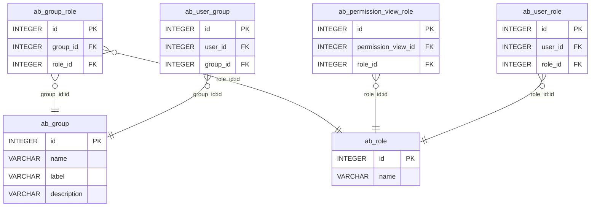

# db-diagram

[](https://github.com/enorganic/db-diagram/actions/workflows/test.yml)
[](https://badge.fury.io/py/db-diagram)

This package provides a CLI and library for generating
[Mermaid Entity Relationship Diagrams
](https://mermaid.js.org/syntax/entityRelationshipDiagram.html)
based on an existing database [connection URL
](https://docs.sqlalchemy.org/en/20/core/engines.html#database-urls) and/or
[SQLAlchemy metadata.
](https://docs.sqlalchemy.org/en/20/core/metadata.html)



## Installation

You can install `db-diagram` with pip:

```shell
pip3 install db-diagram
```

## Usage

You can utilize `db-diagram` as a
[CLI](https://db-diagram.enorganic.or/cli/) (from a shell or command prompt),
or as a [python library](https://db-diagram.enorganic.or/api/)
(`from db_diagram import write_markdown`).
The CLI will be more convenient under most circumstances, however
if you want to generate diagrams from [SQLAlchemy metadata
](https://docs.sqlalchemy.org/en/20/core/metadata.html) rather than
a connection URL, such as you might for a
[SQLAlchemy ORM](https://docs.sqlalchemy.org/en/latest/orm/),
you will want to use `db_diagram` as a python library.
Pease refer to [these examples](https://db-diagram.enorganic.or/examples/)
for reference concerning output.

