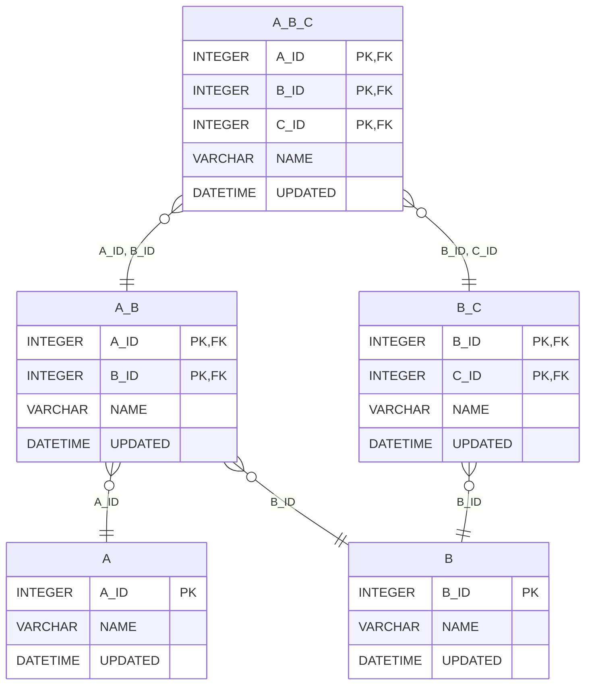
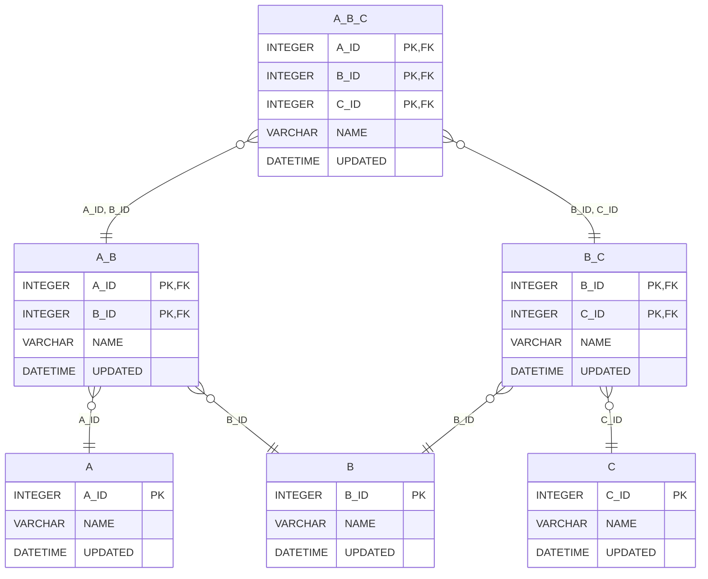
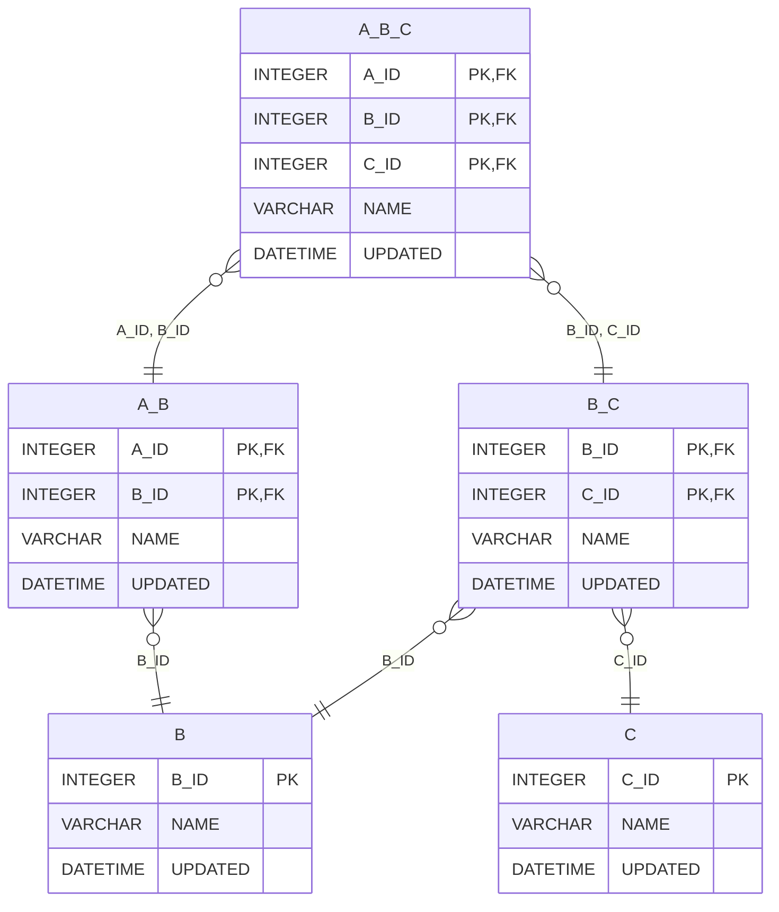

# diagrams

## A

```mermaid
erDiagram
    A {
        INTEGER A_ID PK
        VARCHAR NAME
        DATETIME UPDATED
    }
    A_B {
        INTEGER A_ID PK, FK
        INTEGER B_ID PK, FK
        VARCHAR NAME
        DATETIME UPDATED
    }
    A_B }o--|| A : "A_ID"
    A_B }o--|| B : "B_ID"
    A_B_C {
        INTEGER A_ID PK, FK
        INTEGER B_ID PK, FK
        INTEGER C_ID PK, FK
        VARCHAR NAME
        DATETIME UPDATED
    }
    A_B_C }o--|| A_B : "A_ID, B_ID"
    A_B_C }o--|| B_C : "B_ID, C_ID"
    B_C {
        INTEGER B_ID PK, FK
        INTEGER C_ID PK, FK
        VARCHAR NAME
        DATETIME UPDATED
    }
    B_C }o--|| B : "B_ID"
    B {
        INTEGER B_ID PK
        VARCHAR NAME
        DATETIME UPDATED
    }
```

## A_B

```mermaid
erDiagram
    A_B {
        INTEGER A_ID PK, FK
        INTEGER B_ID PK, FK
        VARCHAR NAME
        DATETIME UPDATED
    }
    A_B }o--|| A : "A_ID"
    A_B }o--|| B : "B_ID"
    A {
        INTEGER A_ID PK
        VARCHAR NAME
        DATETIME UPDATED
    }
    A_B_C {
        INTEGER A_ID PK, FK
        INTEGER B_ID PK, FK
        INTEGER C_ID PK, FK
        VARCHAR NAME
        DATETIME UPDATED
    }
    A_B_C }o--|| A_B : "A_ID, B_ID"
    A_B_C }o--|| B_C : "B_ID, C_ID"
    B_C {
        INTEGER B_ID PK, FK
        INTEGER C_ID PK, FK
        VARCHAR NAME
        DATETIME UPDATED
    }
    B_C }o--|| B : "B_ID"
    B_C }o--|| C : "C_ID"
    B {
        INTEGER B_ID PK
        VARCHAR NAME
        DATETIME UPDATED
    }
    C {
        INTEGER C_ID PK
        VARCHAR NAME
        DATETIME UPDATED
    }
```

## A_B_C

```mermaid
erDiagram
    A_B_C {
        INTEGER A_ID PK, FK
        INTEGER B_ID PK, FK
        INTEGER C_ID PK, FK
        VARCHAR NAME
        DATETIME UPDATED
    }
    A_B_C }o--|| A_B : "A_ID, B_ID"
    A_B_C }o--|| B_C : "B_ID, C_ID"
    A_B {
        INTEGER A_ID PK, FK
        INTEGER B_ID PK, FK
        VARCHAR NAME
        DATETIME UPDATED
    }
    A_B }o--|| A : "A_ID"
    A_B }o--|| B : "B_ID"
    A {
        INTEGER A_ID PK
        VARCHAR NAME
        DATETIME UPDATED
    }
    B {
        INTEGER B_ID PK
        VARCHAR NAME
        DATETIME UPDATED
    }
    B_C {
        INTEGER B_ID PK, FK
        INTEGER C_ID PK, FK
        VARCHAR NAME
        DATETIME UPDATED
    }
    B_C }o--|| B : "B_ID"
```

## B

```mermaid
erDiagram
    B {
        INTEGER B_ID PK
        VARCHAR NAME
        DATETIME UPDATED
    }
    A_B {
        INTEGER A_ID PK, FK
        INTEGER B_ID PK, FK
        VARCHAR NAME
        DATETIME UPDATED
    }
    A_B }o--|| A : "A_ID"
    A_B }o--|| B : "B_ID"
    A {
        INTEGER A_ID PK
        VARCHAR NAME
        DATETIME UPDATED
    }
    A_B_C {
        INTEGER A_ID PK, FK
        INTEGER B_ID PK, FK
        INTEGER C_ID PK, FK
        VARCHAR NAME
        DATETIME UPDATED
    }
    A_B_C }o--|| A_B : "A_ID, B_ID"
    A_B_C }o--|| B_C : "B_ID, C_ID"
    B_C {
        INTEGER B_ID PK, FK
        INTEGER C_ID PK, FK
        VARCHAR NAME
        DATETIME UPDATED
    }
    B_C }o--|| B : "B_ID"
```

## B_C

```mermaid
erDiagram
    B_C {
        INTEGER B_ID PK, FK
        INTEGER C_ID PK, FK
        VARCHAR NAME
        DATETIME UPDATED
    }
    B_C }o--|| B : "B_ID"
    B_C }o--|| C : "C_ID"
    A_B_C {
        INTEGER A_ID PK, FK
        INTEGER B_ID PK, FK
        INTEGER C_ID PK, FK
        VARCHAR NAME
        DATETIME UPDATED
    }
    A_B_C }o--|| A_B : "A_ID, B_ID"
    A_B_C }o--|| B_C : "B_ID, C_ID"
    A_B {
        INTEGER A_ID PK, FK
        INTEGER B_ID PK, FK
        VARCHAR NAME
        DATETIME UPDATED
    }
    A_B }o--|| A : "A_ID"
    A_B }o--|| B : "B_ID"
    A {
        INTEGER A_ID PK
        VARCHAR NAME
        DATETIME UPDATED
    }
    B {
        INTEGER B_ID PK
        VARCHAR NAME
        DATETIME UPDATED
    }
    C {
        INTEGER C_ID PK
        VARCHAR NAME
        DATETIME UPDATED
    }
```

## C

```mermaid
erDiagram
    C {
        INTEGER C_ID PK
        VARCHAR NAME
        DATETIME UPDATED
    }
    B_C {
        INTEGER B_ID PK, FK
        INTEGER C_ID PK, FK
        VARCHAR NAME
        DATETIME UPDATED
    }
    B_C }o--|| B : "B_ID"
    B_C }o--|| C : "C_ID"
    A_B_C {
        INTEGER A_ID PK, FK
        INTEGER B_ID PK, FK
        INTEGER C_ID PK, FK
        VARCHAR NAME
        DATETIME UPDATED
    }
    A_B_C }o--|| A_B : "A_ID, B_ID"
    A_B_C }o--|| B_C : "B_ID, C_ID"
    A_B {
        INTEGER A_ID PK, FK
        INTEGER B_ID PK, FK
        VARCHAR NAME
        DATETIME UPDATED
    }
    A_B }o--|| B : "B_ID"
    B {
        INTEGER B_ID PK
        VARCHAR NAME
        DATETIME UPDATED
    }
```
